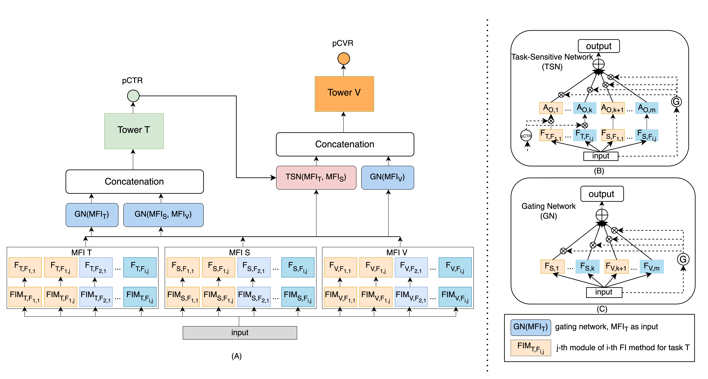

# Deep Multiple Task-specific Feature Interactions Network for Multi-Task Recommendation

## Model Architecture


## Bibtex:
```
TODO 
```

## Abstract 
Neural-based multi-task learning (MTL) has been successfully applied to many recommendation applications. However, these MTL
models (e.g., MMoE, PLE) did not consider feature interaction during the optimization, which is crucial for capturing complex highorder features and has been widely used in ranking models for real-world recommender systems. Moreover, through feature importance analysis across various tasks in MTL, we have observed an interesting divergence phenomenon that the same feature can
have significantly different importance across different tasks in MTL. To address these issues, we propose Deep Multiple Taskspecific Feature Interactions Network (DTN) with a novel model structure design. DTN introduces multiple diversified task-specific feature interaction methods in MTL networks, enabling the model to learn task-specific diversified feature interaction representations, which improves the efficiency of joint representation learning in a general setup. We applied DTN to our company’s real-world Ecommerce recommendation dataset, which consisted of over 6.3 billion samples, the results demonstrated that DTN significantly outperformed state-of-the-art MTL models. Moreover, during online evaluation of DTN in a large-scale E-commerce recommender system, we observed a 3.28% in clicks, a 3.1% increase in orders and a 2.7% increase in GMV (Gross Merchandise Value) compared to the state-of-the-art MTL models. Finally, extensive offline experiments conducted on public benchmark datasets demonstrate that DTN can be applied to various scenarios beyond recommendations, enhancing the performance of ranking models.

## Project structure
```
├── code
    ├── aliccp
        ├── models
            ├── common 
            ├── components 
            ├── memonet
                ├── memonet_model.py
            ├── base_model.py
            ├── gdcn.py 
            ├── masknet.py 
        ├── DTN.py
        ├── MMoE.py
        ├── PLE.py
        ├── run.sh
├── data 
    ├── aliccp
        ├── train_data
            ├── train_data.csv
        ├── test_data
            ├── test_data.csv
        ├── vocab
            ├── ID feature index files
        ├── reader.py
├── README.md
```

## Prerequisites

- Python >= 3.6.8
- TensorFlow-GPU == 1.14

## Quick start
### Installation

- Install TensorFlow-GPU 1.14
- Clone this repo

### [Ali-CCP: Alibaba Click and Conversion Prediction](https://tianchi.aliyun.com/dataset/dataDetail?dataId=408)
Running sample trainning data 
```bash 
code code/aliccp 
python3 DTN.py 
``` 

Running Fully trainning data 
```bash
cd code/aliccp
sh run.sh
```

## Acknowledgement

TODO 